  

## 📌 About Me
- 💻 I'm an aspiring Full Stack Developer specializing in the MERN Stack.
- 🌱 I'm currently learning React.js, Node.js, Express.js, MongoDB, and TypeScript.
- 🚀 I'm building industry-level projects to strengthen my software engineering skills.
- 🧠 I'm focused on Clean Architecture, REST APIs, Authentication, and System Design.
- 🤝 I'm open to collaborating on Full Stack, Open Source, and JavaScript projects.
- 🎯 My goal is to build scalable software that solves real-world problems.
- ⚡ I believe in continuous learning, consistency, and clean code.
- 📫 Reach me at: vimaleshwaranvelayudham@gmail.com

## 📊 GitHub Stats & Trophies

  
  

  

  

  

## 🛠️ Languages & Tools

<h3 align="center">Programming Languages</h3>

  &nbsp;&nbsp;
  

<h3 align="center">Frontend</h3>

  &nbsp;&nbsp;
  &nbsp;&nbsp;
  &nbsp;&nbsp;
  &nbsp;&nbsp;
  

<h3 align="center">Backend</h3>

  &nbsp;&nbsp;
  

<h3 align="center">Database</h3>

  &nbsp;&nbsp;
  &nbsp;&nbsp;
  &nbsp;&nbsp;
  

<h3 align="center">DevOps & Cloud</h3>

  &nbsp;&nbsp;
  

<h3 align="center">Tools</h3>

  &nbsp;&nbsp;
  &nbsp;&nbsp;
  &nbsp;&nbsp;
  

  

 

## 🔗 Connect with Me

  &nbsp;&nbsp;
  

  

  

